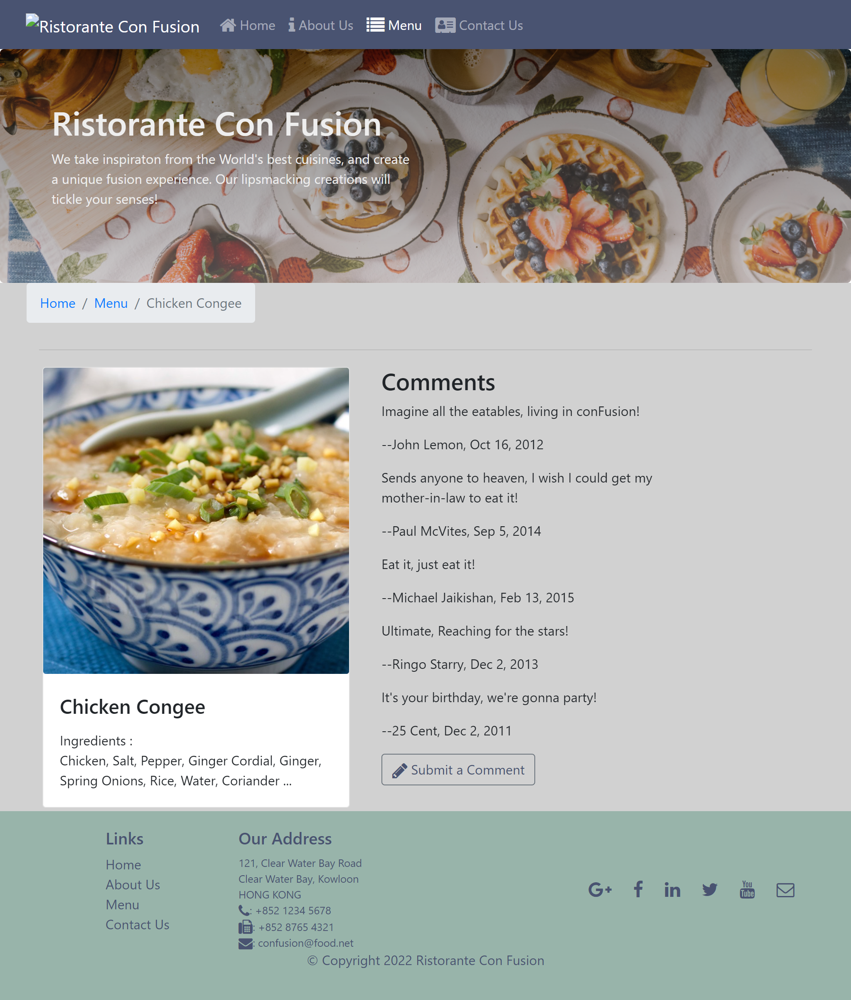
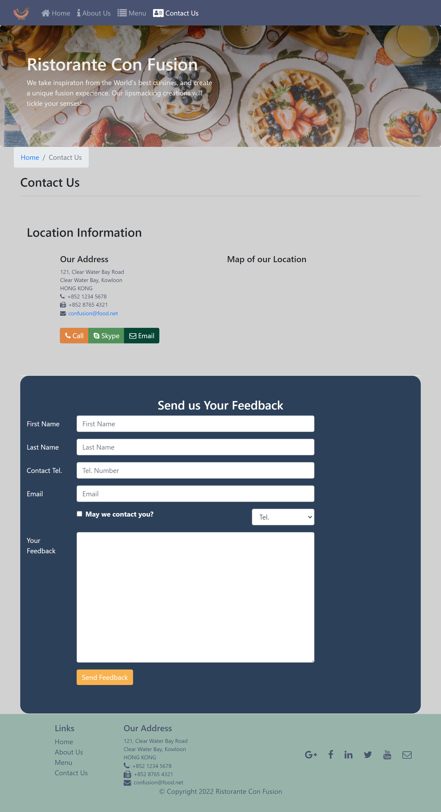

# Ristorante Con Fusion

## Table of contents

- [Overview](#overview)
  - [Demo](#demo)
  - [Screenshot](#screenshot)
    - [Desktop](#desktop)
    - [Mobile](#mobile)
  - [Links](#links)
- [My process](#my-process)
  - [Built with](#built-with)
  - [What I learned](#what-i-learned)
- [Author](#author)


## Overview
This is a modern restaurant webpage featuring various sections like about, menu and contact. The users get to post reviews of the dishes and also submit their feedback. The data is fetched from a free meal API. 
### Demo


### Screenshot

#### Desktop








### Links

- Solution URL: [https://github.com/NandodkarAmogh/Ristorante-Con-Fusion-React](https://github.com/NandodkarAmogh/Ristorante-Con-Fusion-React)
- Live Site URL: []()

## My process

### Built with

- Mobile-first workflow
- [React](https://reactjs.org/) - JS library
- [React Router](https://reactrouter.com/) 
- [Redux](https://redux.js.org/) - State management and actions
- [Reactstrap](https://reactstrap.github.io/) - For styles
- [React Awesome Reveal](https://www.npmjs.com/package/react-awesome-reveal) - For Animations
- [Free Meal API] (https://www.themealdb.com/api.php)

### What I learned

I have tried to improve on the my previous restaurant website where I learned

- React Components
- React Router
- SPA
- React Forms
- Redux for state management
- Redux Actions
- React Redux form
- Client Server Communication (setting up a JSON server)
- Fetch
- React Animations


```react

//for fetching dishes from api
export const fetchDishes = (string) => (dispatch) => {

    dispatch(dishesLoading(true));

    return setTimeout(() => {
        
        fetch(`https://www.themealdb.com/api/json/v1/1/search.php?s=${string}`)
        .then(response => {
            if (response.ok) {
                return response;
            } else {
                var error = new Error('Error ' + response.status + ': ' + response.statusText);
                error.response = response;
                throw error;
            }
            },
            error => {
                var errmess = new Error(error.message);
                throw errmess;
            }
        )
        .then(response => response.json())
        .then(dishes => dispatch(addDishes(dishes)))
        .catch(error => dispatch(dishesFailed(error.message)));
    }, 2000);
    
}

```
## Author

- Github - [@NandodkarAmogh](https://github.com/NandodkarAmogh)


