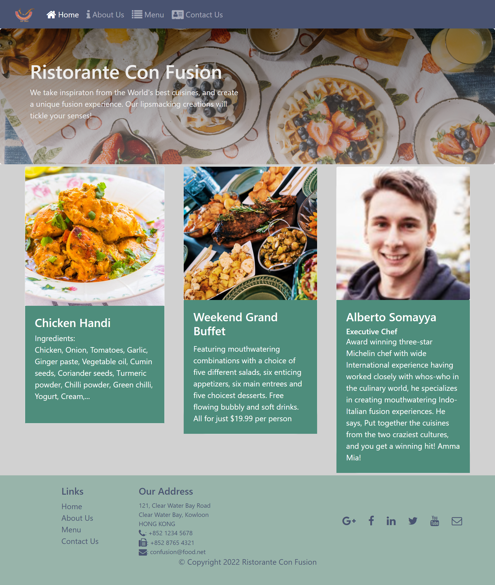

# Ristorante Con Fusion

## Table of contents

- [Overview](#overview)
  - [Demo](#demo)
  - [Screenshot](#screenshot)
    - [JSON Server](#json-server)
    - [Desktop](#desktop)
    - [Mobile](#mobile)
  - [Links](#links)
- [My process](#my-process)
  - [Built with](#built-with)
  - [What I learned](#what-i-learned)
- [Author](#author)


## Overview
This is a modern restaurant webpage featuring various serctions like about, menu and contact. The users get to post reviews of the dishes and also submit their feedback. The data is fetched from a JSON server that was set up for the project. 
### Demo


### Screenshot

#### JSON Server


#### Desktop



#### Mobile


### Links

- Solution URL: []()
- Live Site URL: []()

## My process

### Built with

- Mobile-first workflow
- [React](https://reactjs.org/) - JS library
- [React Router](https://reactrouter.com/) 
- [Redux](https://redux.js.org/) - State management and actions
- [Reactstrap](https://reactstrap.github.io/) - For styles
- [React Awesoem Reveal](https://www.npmjs.com/package/react-awesome-reveal) - For Animations

### What I learned

This project is a part of the frontend developemnt course where I learnt concepts like
- React Components
- React Router
- SPA
- React Forms
- Redux for state management
- Redux Actions
- React Redux form
- Client Server Communication (setting up a JSON server)
- Fetch
- React Animations


```react

  // For posting comments to the server
    export const postComment = (dishId, rating, author, comment) => (dispatch) => {

    const newComment = {
        dishId: dishId,
        rating: rating,
        author: author,
        comment: comment
    };
    newComment.date = new Date().toISOString();
    
    return fetch(baseUrl + 'comments', {
        method: "POST",
        body: JSON.stringify(newComment),
        headers: {
          "Content-Type": "application/json"
        },
        credentials: "same-origin"
    })
    .then(response => {
        if (response.ok) {
          return response;
        } else {
          var error = new Error('Error ' + response.status + ': ' + response.statusText);
          error.response = response;
          throw error;
        }
      },
      error => {
            throw error;
      })
    .then(response => response.json())
    .then(response => dispatch(addComment(response)))
    .catch(error =>  { console.log('post comments', error.message); alert('Your comment could not be posted\nError: '+error.message); });
};

//for fetching comments from server
export const fetchComments = () => (dispatch) => {    
    return fetch(baseUrl + 'comments')
    .then(response => {
        if (response.ok) {
            return response;
          } else {
            var error = new Error('Error ' + response.status + ': ' + response.statusText);
            error.response = response;
            throw error;
          }
        },
        error => {
              var errmess = new Error(error.message);
              throw errmess;
        }
    )
    .then(response => response.json())
    .then(comments => dispatch(addComments(comments)))
    .catch(error => dispatch(commentsFailed(error.message)));
};

```
## Author

- Github - [@NandodkarAmogh](https://github.com/NandodkarAmogh)


